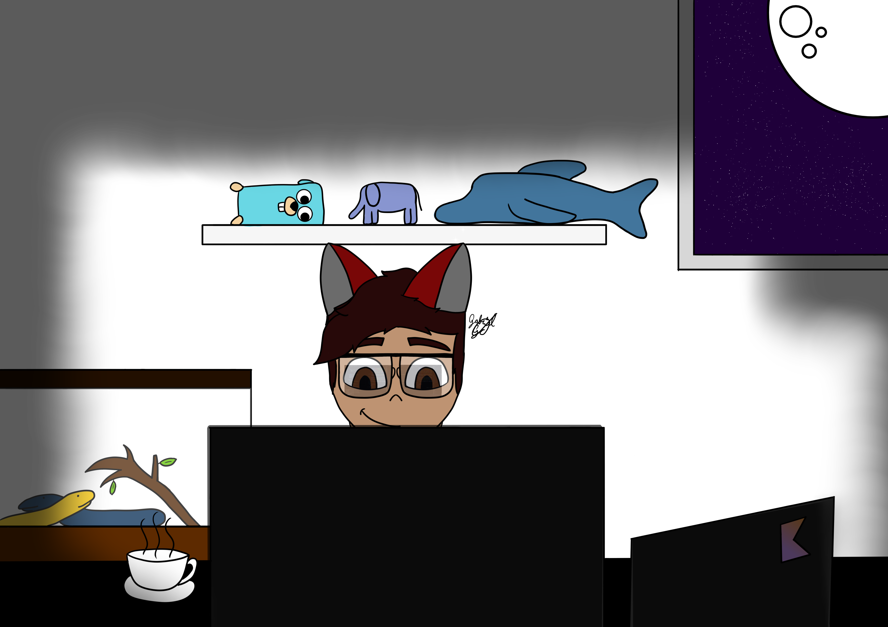

# EAE! 👋 / Hey There! 👋

Sou Gabriel Gomes, estou ainda no início do meu percurso no incrível mundo da tecnologia e da programação! Fazendo ainda projetos pequenos.

I'm Gabriel Gomes, I still in the beginning of my way in the incredible world of the technology and programming! Doing just little projects.

### Social:

       

### OSs quais já tive contato (usei) / OSs that I already have used:
        

### Linguanges de programação qual mais tenho conhecimentos / Programming languages that I have more knowlege:
    

### IDEs
     

### GitHub Status

